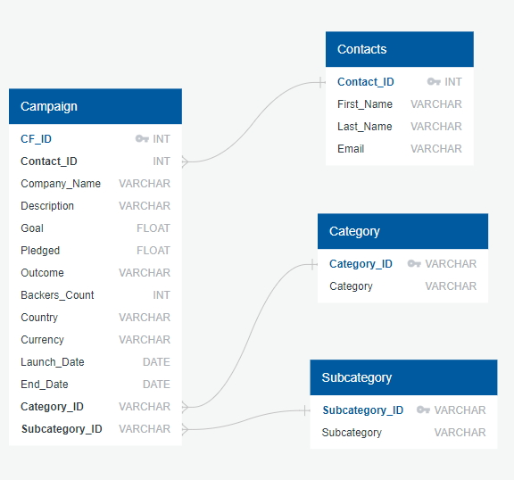
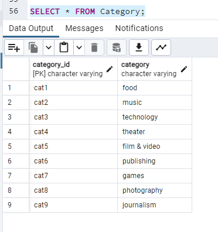
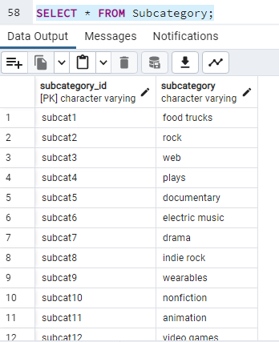
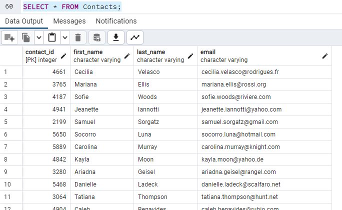
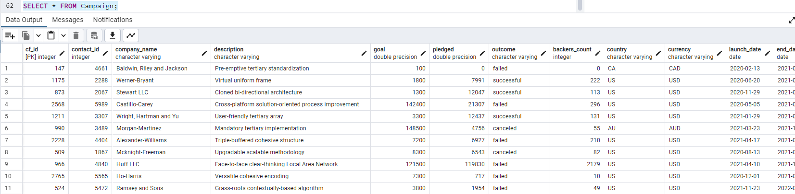

# Crowdfunding_ETL
This repository is for the Data Analytics Bootcamp Project 2

The first portion of this challenge involved performing ETL (Extract-Transform-Load) processes on crowdfunding data. After several steps of maipulation and dataframe creation, we were able to create 4 dataframes with cleaned versions of the original data and export them into separate CSV files. All 4 CSVs can be found within the Resources folder (category.csv, campaign.csv, contacts.csv, and subcategory.csv).

The second portion of this challenge involved creating a SQL database and importing the cleaned data. The SQL schema can be found within the Resources folder. The ERD image as well as the successfully imported table images can be found within the Images folder.

## We were able to create an Entity Relationship Diagram of the Crowdfunding Data: 

## We were able to successfully create the database and import the CSV files based on our SQL schema:

We referenced class activities and instruction provided by Instructor Brett Barnes and TA Ally Qi to complete this activity.
